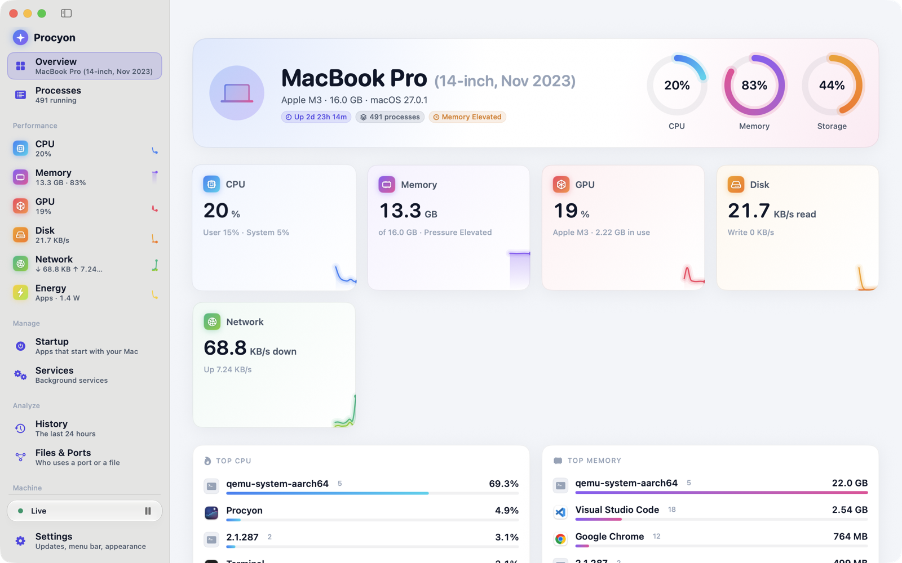
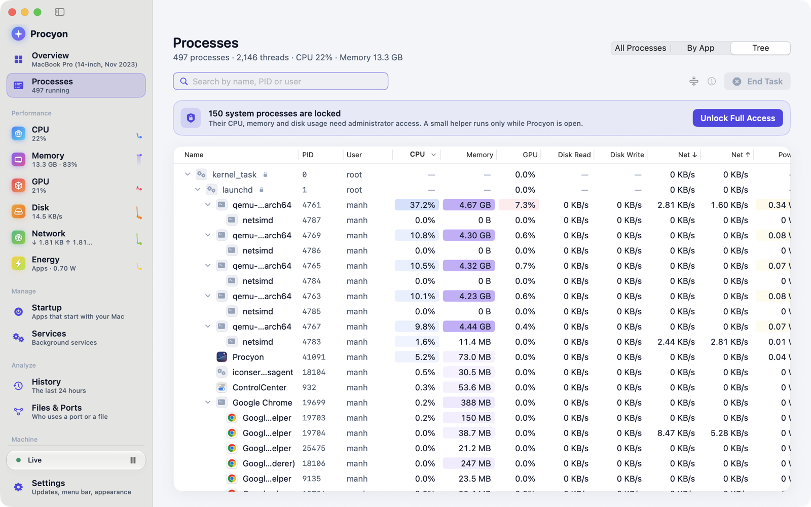
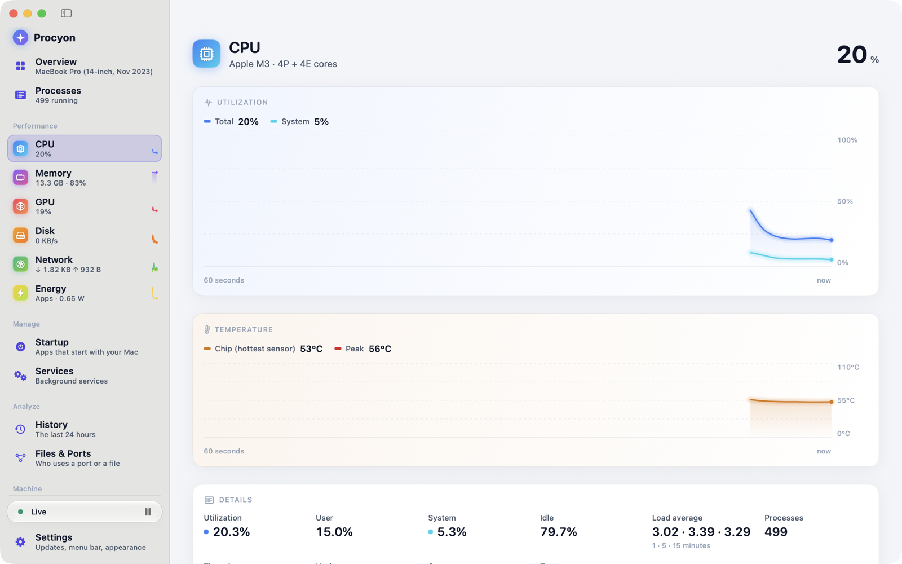
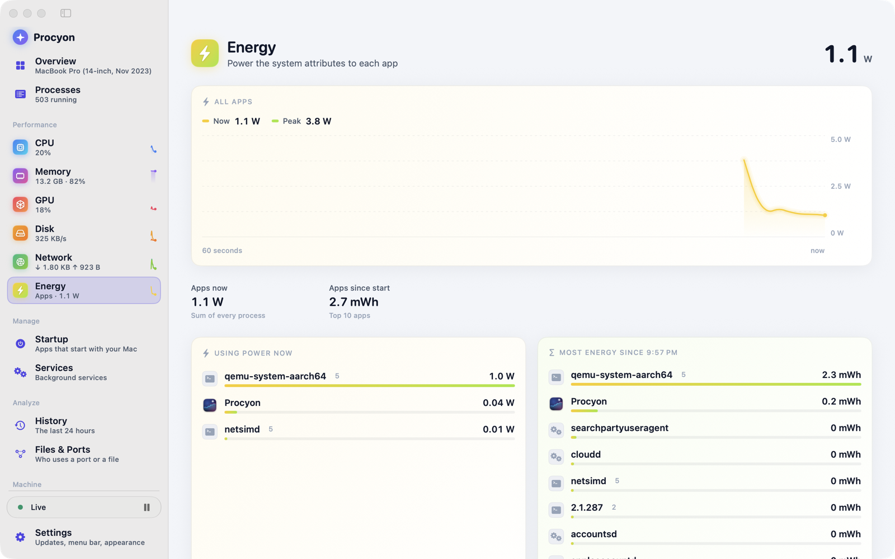
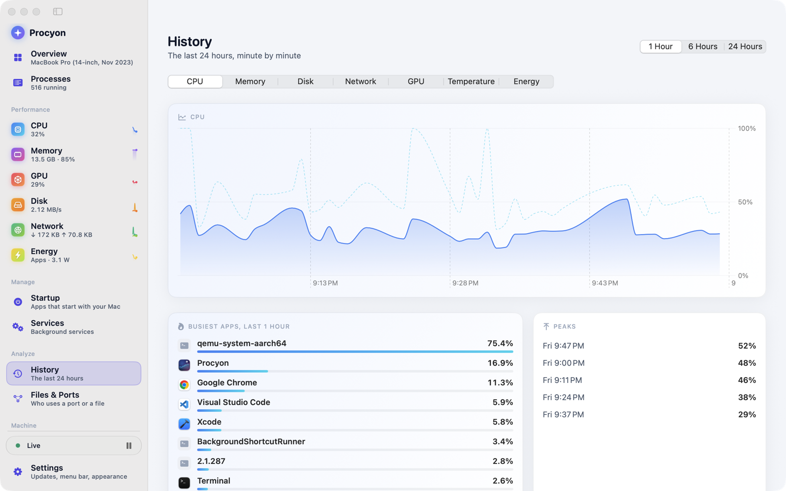
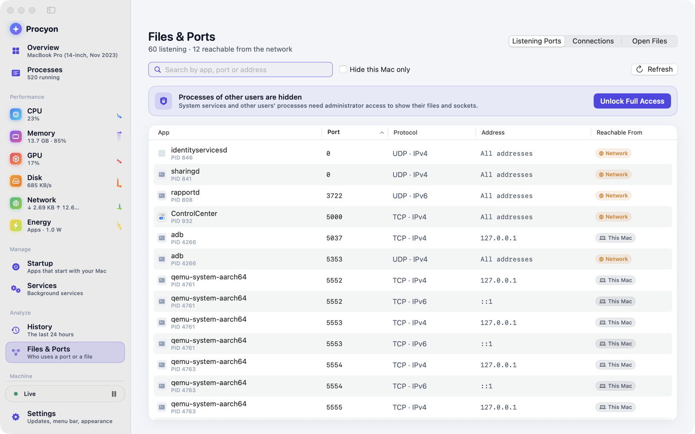
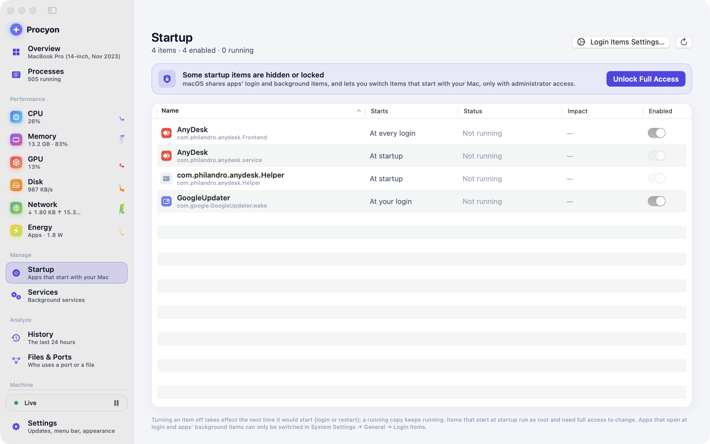

# Procyon

A lightweight, open-source task manager for macOS, Windows and Linux. See what is using your CPU, memory, disk,
network, GPU and battery, find out what a process is, and stop the ones you don't need.

The macOS app is complete (P2 in the [spec](docs/procyon-spec.md)); the Windows app is new and covers the same
screens: processes, performance, GPU, battery, startup, services, History, alerts and Files & Ports (status in
[docs/development.md](docs/development.md#windows)). The Linux app (GTK 4) is newer still and shares the Windows
app's screens (status in [docs/development.md](docs/development.md#linux)).

<picture>
  <source media="(prefers-color-scheme: dark)" srcset="docs/screenshots/overview-dark.png">
  
</picture>

- **Processes**: every running process with CPU, memory, disk, network, GPU and power, as a flat list,
  grouped by app or as a tree. Search, sort, end, force quit, suspend, change priority.
- **Live charts**: CPU (total and per core), memory and swap, disk, network, GPU, temperatures.
- **Startup and Services**: login items, launch agents and daemons. Turn them on or off, start, stop and restart them.
- **Energy and Battery**: power use per app, battery health and cycles, and which apps keep your Mac awake.
- **History**: the last 24 hours of every metric. Click a spike to see which apps caused it.
- **Files & Ports**: listening ports, network connections, open files, and **Who Is Using…** for a file or disk.
- **Plain-language explanations** for about 110 common macOS processes: what each one is, and whether it is safe to end.
- **Menu bar widget**, **alerts** with your own thresholds, a **⌘K command palette**, and light and dark mode.

Procyon is light on resources: sampling uses about 0.5% of one core.

## Screenshots

<table>
<tr>
<td width="50%">

**Processes**

<picture>
  <source media="(prefers-color-scheme: dark)" srcset="docs/screenshots/processes-dark.png">
  
</picture>

</td>
<td width="50%">

**CPU**

<picture>
  <source media="(prefers-color-scheme: dark)" srcset="docs/screenshots/cpu-dark.png">
  
</picture>

</td>
</tr>
<tr>
<td width="50%">

**Energy**

<picture>
  <source media="(prefers-color-scheme: dark)" srcset="docs/screenshots/energy-dark.png">
  
</picture>

</td>
<td width="50%">

**History**

<picture>
  <source media="(prefers-color-scheme: dark)" srcset="docs/screenshots/history-dark.png">
  
</picture>

</td>
</tr>
<tr>
<td width="50%">

**Files & Ports**

<picture>
  <source media="(prefers-color-scheme: dark)" srcset="docs/screenshots/inspect-dark.png">
  
</picture>

</td>
<td width="50%">

**Startup**

<picture>
  <source media="(prefers-color-scheme: dark)" srcset="docs/screenshots/startup-dark.png">
  
</picture>

</td>
</tr>
</table>

## Requirements

- macOS 14 Sonoma or later, Apple Silicon or Intel (the release is a universal app)
- Windows 10 version 1809 or later, or Windows 11, 64-bit
- Linux with GTK 4.12 or later and systemd for the Services screen (Ubuntu 24.04, Fedora 39, Debian 13 or
  newer), x86-64

## Install

### Windows

1. Download the latest `Procyon-x.y.z-windows-x64.zip` from the [Releases page](https://github.com/manhpham90vn/Procyon/releases/latest).
2. Unzip it anywhere and run `Procyon.exe`. There is no installer and nothing to register; settings live in
   `HKEY_CURRENT_USER\Software\Procyon`.
3. To check the download, compare it with the `.sha256` file from the same release:

```powershell
(Get-FileHash .\Procyon-x.y.z-windows-x64.zip).Hash
```

The Windows build is not code-signed yet, so SmartScreen may ask once (More info → Run anyway) and Smart App
Control, where it is on, refuses unsigned apps altogether.

### Linux

1. Download the latest `Procyon-x.y.z-linux-x86_64.tar.gz` from the [Releases page](https://github.com/manhpham90vn/Procyon/releases/latest).
2. Unpack it into `~/.local` (or `/usr/local` with `sudo`): the binary goes to `bin`, the desktop entry, icon
   and licenses to `share`, and Procyon appears in your app grid.

```sh
tar -xzf Procyon-x.y.z-linux-x86_64.tar.gz --strip-components=1 -C ~/.local
sha256sum -c Procyon-x.y.z-linux-x86_64.sha256   # optional: check the download
```

Settings live in `~/.config/procyon/settings.ini`, the history in `~/.local/share/procyon`.

### Homebrew

```sh
brew install --cask manhpham90vn/tap/procyon
```

Update with `brew upgrade --cask procyon`.

### Download

1. Download the latest `Procyon-x.y.z.dmg` from the [Releases page](https://github.com/manhpham90vn/Procyon/releases/latest).
2. Open the DMG and drag **Procyon** into **Applications**.
3. Open Procyon from Applications or Spotlight.

Releases are signed with a Developer ID and notarized by Apple, so they open without Gatekeeper warnings.
To check your download, compare it with the `.sha256` file from the same release:

```sh
shasum -a 256 Procyon-x.y.z.dmg
```

## Using Procyon

### Getting around

Pick a screen in the sidebar, or use the keyboard:

| Shortcut | Action |
| --- | --- |
| `⌘1` … `⌘9` | Overview, Processes, CPU, Memory, GPU, Disk, Network, Startup, Services |
| `⌘K` | Command palette: jump to a screen, run a command, act on an app |
| `⌘F` | Find a process |
| `⌘I` | Get Info on the selected process |
| `⌘⌫` | End Task |
| `⌥⌘⌫` | Force Quit |
| `⇧⌥⌘⌫` | End Process Tree |
| `⇧⌘P` | Pause or resume updates |
| `⌘,` | Settings |

On Windows, `Ctrl` stands in for `⌘`: `Ctrl+1`…`Ctrl+9` for the screens, `Ctrl+K` for the palette, `Ctrl+F`
to find, `Ctrl+I` for Get Info, `Delete` or `Ctrl+Backspace` for End Task, `Shift+Delete` or
`Ctrl+Alt+Backspace` for Force Quit, `Ctrl+Shift+Alt+Backspace` for End Process Tree, `Ctrl+Shift+P` to pause
and `Ctrl+,` for Settings.

### Ending a process

Select a process in **Processes** and press `⌘⌫` (or use the **Process** menu or the ⌘K palette). Procyon asks for confirmation before
ending system processes and shows what the process does, if it knows. The kernel, `launchd` and Procyon
itself are protected and can't be ended.

### Full access

Procyon runs as your normal user. Processes owned by root show `—` with a lock icon until you click
**Unlock Full Access** (the banner on Processes, Startup or Services, or in the ⌘K palette). macOS then asks
you to allow Procyon's helper in **System Settings → General → Login Items**. You only do this once, and you
need an administrator account.

Full access lets Procyon show every process, act on other users' processes, raise priority, and manage
system services. To take it back, open **Settings → Full access**: **Turn Off Full Access** disconnects for now and
keeps the helper approved, **Remove Administrator Helper** also unregisters it from Login Items. Both are in the ⌘K
palette too.

On Windows there is no helper: **Unlock Full Access** (the banner on Processes, Startup or Services, Settings, or
the `Ctrl+K` palette) restarts Procyon as administrator through the usual User Account Control prompt. Without it,
Procyon still lists every process with its CPU, memory and disk use, but other users' command lines and open
files stay hidden, their processes can't be ended, and services and machine-wide startup entries can't be changed.

On Linux there is no helper either: Procyon reads every process's CPU and memory as your user, systemd asks for
your password (through the desktop's polkit dialog) when you start, stop or switch a system service, and
machine-wide startup entries are switched with a per-user override, as GNOME and KDE do. **Unlock Full Access**
restarts Procyon as root through `pkexec`, which lets it end other users' processes, raise priority and read
their command lines, files and disk use.

### Menu bar

Closing the window keeps Procyon running in the menu bar instead of the Dock. Choose what the menu bar
shows (CPU, memory, network, GPU, temperature, battery) in **Settings → Menu bar**. Click the menu bar item and
choose **Open Procyon** to bring the window back, or **Quit** to exit.

### Alerts

**Settings → Alerts** sends a notification when CPU, memory, memory pressure, CPU temperature, or a single
app's CPU or memory stays over a threshold for a time you choose.

### History

**History** keeps one sample a minute for 24 hours, so you can see what was slowing your Mac down earlier.
Pick a metric and a range (1, 6 or 24 hours), then click the chart or a peak to see the busiest apps at that
moment. You can turn recording off or clear it in Settings. It uses a few MB in
`~/Library/Application Support/Procyon`.

## Uninstall

On macOS:

1. If you unlocked full access, open **Settings → Full access** and click **Remove Administrator Helper**.
2. Quit Procyon and move it from Applications to the Trash, or run `brew uninstall --cask procyon`.
3. Optionally, delete its history: `~/Library/Application Support/Procyon`
   (`brew uninstall --cask --zap procyon` removes it along with the settings).

On Windows, quit Procyon (right-click its tray icon → Quit), delete the folder you unzipped it into, and
optionally delete the settings key `HKEY_CURRENT_USER\Software\Procyon`.

On Linux, quit Procyon (`Ctrl+Q`), delete `bin/procyon`, `share/applications/dev.procyon.Procyon.desktop`,
`share/metainfo/dev.procyon.Procyon.metainfo.xml`, `share/icons/hicolor/512x512/apps/dev.procyon.Procyon.png`
and `share/licenses/procyon` from where you unpacked it, and optionally `~/.config/procyon` and
`~/.local/share/procyon`.

## Known limitations

- The interface is English only.
- Not available on macOS: CPU affinity, GPU encode/decode usage, fan speeds, and closing another process's
  network connection.
- Not yet on Windows: per-app energy (Windows has no energy counters) and the menu bar style widget (the tray
  icon shows the chosen metrics in its tooltip). Per-process network and the list of apps preventing sleep need
  Full Access (administrator rights), as Windows itself requires for them.
  Temperatures come from the ACPI thermal zones (the motherboard sensors the firmware publishes, not the CPU die, which needs a kernel driver; a zone whose reading never moves is labelled as the board's) and the system drive, which not every PC exposes.
  GPU temperature is read for NVIDIA cards only (AMD and Intel: not yet).
- On Linux, per-app network counts TCP only (QUIC and other UDP traffic, much of a browser's video, has no
  per-socket counters) and only your own apps without Full Access; a new connection is counted from the moment
  Procyon finds it (within 3 seconds). Overall GPU usage on Intel is how long the GPU was awake, which reads a
  little high at light loads. The tray icon needs a desktop that hosts one (KDE, XFCE, Cinnamon, Ubuntu's
  GNOME), and the figures beside it (**Settings → Notification area**) one that shows labels (Ubuntu's GNOME;
  KDE puts them in the tooltip); on plain GNOME, **Keep running in the background** keeps Procyon sampling with
  the window closed.
  Not yet: per-app energy (RAPL is root-only).

## Building from source

### macOS

You need Xcode 27 on macOS 14 or later.

```sh
git clone https://github.com/manhpham90vn/Procyon.git
cd Procyon
make run      # build dist/Procyon.app and open it
make test     # run the unit tests
make help     # all targets
```

Builds from source are ad-hoc signed. Full access then works through a password prompt each launch
instead of the one-time approval.

### Windows

You need Visual Studio 2022 with the **Desktop development with C++** workload and GNU Make
(`winget install ezwinports.make`). The same `make` targets work as on macOS, from cmd, PowerShell or Git Bash:

```bat
git clone https://github.com/manhpham90vn/Procyon.git
cd Procyon
make tools    rem once: fetches CMake, Ninja and clang-format into build\tools (skip if Visual Studio's CMake component is installed)
make run      rem build dist\windows\Procyon.exe and open it
make test     rem run the core tests
make help     rem all targets
```

Builds from source are unsigned: Smart App Control, where it is on, won't run them.

### Linux

You need a C++20 compiler, CMake, Ninja and GTK 4 (`make tools` prints the packages for Debian/Ubuntu, Fedora
and Arch):

```sh
sudo apt install build-essential cmake ninja-build pkg-config libgtk-4-dev
pipx install clang-format==19.1.0   # for make lint/format: 19 or later (Ubuntu 24.04's apt package is 18)
git clone https://github.com/manhpham90vn/Procyon.git
cd Procyon
make run       # build dist/linux/procyon and open it
make test      # core tests
make install   # into ~/.local (PREFIX=/usr/local for everyone)
make help      # all targets
```

## Contributing

Bug reports, ideas and pull requests are welcome on
[GitHub Issues](https://github.com/manhpham90vn/Procyon/issues). Before opening a pull request, run
`make format` and `make ci`, which runs the same checks as CI.

The repo layout, CI and release process, how the privileged helper works, and feature status against the
[product spec](docs/procyon-spec.md) are in [docs/development.md](docs/development.md).

## License

Procyon is released under the [MIT License](LICENSE). The Windows and Linux apps embed the
[Inter](https://github.com/rsms/inter) and [Nunito](https://github.com/googlefonts/nunito) typefaces, licensed
under the [SIL Open Font License 1.1](design/fonts/LICENSE-Inter.txt) ([Nunito](design/fonts/LICENSE-Nunito.txt)),
and draws its icons from [Lucide](https://lucide.dev), licensed under the
[ISC License](design/icons/LICENSE-Lucide.txt).
